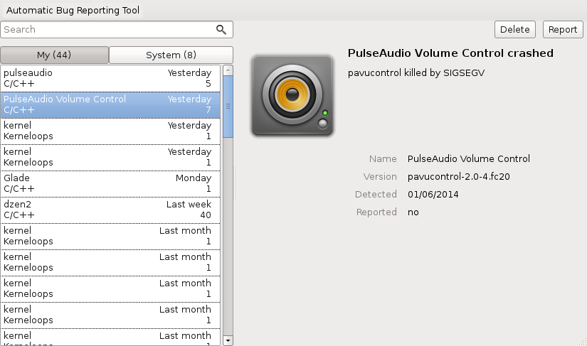

.. _usage:

Usage
=====

Command line
------------

When crash is detected on a headless machine abrt
notifies user via email or console notification,
see :ref:`server_or_headless`.

To list all crashes on a machine run::

        abrt-cli list

Example output::

        id 58101e309c3e473d49b1a7d60868ab7023a62dd6
        reason:         will_abort killed by SIGABRT
        time:           Wed 17 Sep 2014 03:24:07 AM CEST
        cmdline:        will_abort
        package:        will-crash-0.7-4.fc21
        uid:            1000 (mhabrnal)
        count:          1
        Directory:      /var/tmp/abrt/ccpp-2014-09-17-02:51:07-5368

        id 58101e309c3e473d49b1a7d60868ab7023a62dd6
        reason:         will_abort killed by SIGABRT
        time:           Wed 17 Sep 2014 02:51:07 AM CEST
        cmdline:        will_abort
        package:        will-crash-0.7-4.fc21
        uid:            1000 (mhabrnal)
        count:          1
        Directory:      /var/tmp/abrt/ccpp-2014-09-17-02:51:07-5368
        Reported:       cannot be reported

        id afdf8c42ddeb324b975f3510f6e976085b46c4fe
        reason:         will_segfault killed by SIGSEGV
        time:           Tue 16 Sep 2014 11:12:09 PM CEST
        cmdline:        will_segfault
        package:        will-crash-0.7-4.fc21
        uid:            1000 (mhabrnal)
        count:          1
        Directory:      /var/tmp/abrt/ccpp-2014-09-16-23:12:09-4265
        Reported:       https://retrace.fedoraproject.org/faf/reports/bthash/102f484335e2df215da7a92d962d017e7d9edcc9
                        https://bugzilla.redhat.com/show_bug.cgi?id=1124867

Displayed are three crashes collected by abrt. Each crash has an identifier
and a directory that can be used for further manipulation using ``abrt-cli``.
The second crash (from the above example) cannot be reported. Run ``abrt-cli
info -d $ID`` to see why the problem cannot be reported.

To display detailed report about particular problem use::

        abrt-cli list -d <ID_OR_PATH>

To report a problem via ``abrt-cli`` use::

        abrt-cli report <ID_OR_PATH>

To delete a problem run::

        abrt-cli remove <ID_OR_PATH>

For more details consult ``man abrt-cli``.

Selecting a preferred text editor
^^^^^^^^^^^^^^^^^^^^^^^^^^^^^^^^^

During the reporting process ``abrt-cli report`` will
open a text editor. It uses the editor defined in
``$ABRT_EDITOR`` environment variable.
If the variable is not defined, it checks the
``$VISUAL`` and ``$EDITOR`` variables.
If none of these variables is set, ``vi`` is used.

You can set the preferred editor in your ``.bashrc``
configuration file. For example, if you prefer
GNU Emacs, add the following line to the file::

        export EDITOR=emacs

Graphical user interface
------------------------

After a crash is handled by ABRT user is presented
with a notification with options to ignore or report
the problem. If user chooses to report the problem
`gnome-abrt` application opens:

`Report` button then starts a reporting wizard
guiding user through reporting process.

Testing ABRT functionality
--------------------------

To make sure you won't miss a crash of your application you
should verify that abrt works as expected.

Simplest way to do so is to crash ``sleep`` executable available
everywhere::

        sleep 10m &
        kill -SIGSEGV %1

Sleep then produces segmentation fault and should be caught
by abrt's C/C++ hook. If it's not working correctly consult
:ref:`debugging`.

will-crash
^^^^^^^^^^

For testing the functionality of various hooks we've created
a set of crashing executables called ``will-crash`` [#willcrash]_.

First, install the package::

        yum install will-crash

Then run one of the crashing executables depending on which
hook you would like to test, most commonly C/C++::

        will_segfault

This executable segfaults immediately and should be caught
by abrt. To get a list of other crashing executables run::

        rpm -ql will-crash | grep bin

.. rubric:: Footnotes

.. [#willcrash] http://github.com/sorki/will-crash
